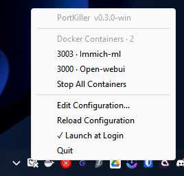

<table>
<tr>
<td width="140" valign="top">

</td>
<td valign="middle">
<h1>PortKiller for Windows</h1>
<p><em>Stop hunting. Start killing.</em><br>
That rogue process hogging port 3000? Gone in one click.</p>
<a href="https://github.com/jdros15/PortKiller-Windows/releases">

</a>
&nbsp;


</td>
</tr>
</table>

Every developer knows the drill: `netstat -ano | findstr 3000`, squint at the output, find the PID, `taskkill /F /PID 1234`, repeat. PortKiller lives in your system tray and does all that for you. One click. Done.

---

## Features

- **One-Click Process Termination** — Kill any process hogging your dev ports instantly from the system tray
- **Docker Integration** — See which containers are using ports and stop them directly
- **Windows Services** — Detect and stop services (PostgreSQL, MySQL, IIS, etc.) without touching the command line
- **Desktop Notifications** — Get notified when new processes start listening on your ports
- **Project Detection** — Shows which git project each process belongs to
- **Smart Graceful Shutdown** — Attempts graceful unique before forcing termination
- **Native System Tray App** — Lightweight, adapts to light/dark mode, zero resource usage when idle
- **Pre-configured for Dev Ports** — Monitors Node.js, React, Vite, Django, Flask, PostgreSQL, Redis, MongoDB, and more out of the box
- **Fully Configurable** — Add or remove port ranges via simple JSON config

## Screenshots


<br>

## Installation

### Installer (Recommended)

1. Download the latest **[Installer](https://github.com/jdros15/PortKiller-Windows/releases)**
2. Run the installer
3. Launch PortKiller from the Start Menu

### Portable

1. Download the latest **[Portable Executable](https://github.com/jdros15/PortKiller-Windows/releases)**
2. Run `portkiller.exe`
3. The app appears in your system tray — click to see active port listeners.

### Build from Source

```powershell
git clone https://github.com/jdros15/PortKiller-Windows.git
cd PortKiller-Windows
cargo build --release
.\target\release\portkiller.exe
```

Requires Rust 1.85+ (2024 edition).

## Configuration

PortKiller creates a configuration file at first run.
Location: `%APPDATA%\PortKiller\portkiller.json`

Edit via the system tray (Edit Configuration) or directly:

```json
{
  "monitoring": {
    "poll_interval_secs": 2,
    "port_ranges": [[3000, 3010], [5432, 5432], [8080, 8090]],
    "show_project_names": true
  },
  "integrations": {
    "windows_services_enabled": true,
    "docker_enabled": true
  },
  "notifications": {
    "enabled": true
  },
  "system": {
    "launch_at_login": false
  }
}
```

Changes require an app restart.

## Uninstall

Use the Windows "Add or remove programs" settings specific, or run the uninstaller in the installation directory.

## Platform Support

**Windows 10 and Windows 11** — x64 (ARM64 support pending)

## Development

```powershell
# Debug build with logging
$env:RUST_LOG="debug"; cargo run

# Code quality
cargo fmt; cargo clippy
```

## Feature Requests & Bug Reports

Have an idea or found a bug? [Open an issue](https://github.com/jdros15/PortKiller-Windows/issues) — contributions welcome!

## License

MIT License — do whatever you want with it.

## Credits

- **Original macOS App**: [Samarth Gupta](https://github.com/gupsammy)
- **Windows Port**: [JD Ros](https://github.com/jdros15)

## Acknowledgments

Built with [tray-icon](https://github.com/tauri-apps/tray-icon), [winit](https://github.com/rust-windowing/winit), and [nix](https://github.com/nix-rust/nix).

---

<p align="center"><em>Made for developers who have better things to do than hunt PIDs</em></p>
